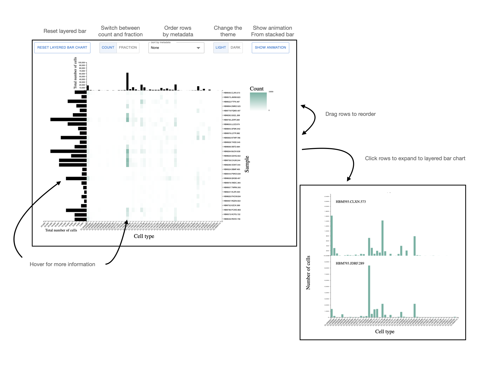

> **_NOTE:_**  This project is a work in progress.

# CellPop: Cell Type Composition Explorer
CellPop is a visualization tool for cell type compositions. It is an NPM package that exports various functions and to create a D3 visualization from various file types.


## Why CellPop? 
Cell type populations are commonly shown with stacked bar charts. However, scaling the number of samples and cell types in these visualizations create issues with analyzing these charts. CellPop alleviates this by presenting a flexible heatmap and side views with extending layered bar charts.

## How to run
This project uses pnpm. 

Install dependencies with:
```sh
pnpm install
```

Run the demo with:
```sh
pnpm run dev
```

## Demo
The demo folder contains three demo's: 
- The combination of index.jsx and demo.jsx are a React demo, using the HuBMAP data loaders and CellPopComponent, which includes the option bar.
- Main.js is a JavaScript only demo that uses the HuBMAP data loaders and the mainVis function to create the visualization. 
- Animation.js shows an animation of how a stacked bar chart converts to the CellPop view.


The React demo is available [here](https://cellpop.netlify.com/).

The main view and interactions:


## Team
[HiDIVE Lab](https://hidivelab.org)
- Thomas C. Smits (<tsmits@hms.harvard.edu>)
- Nikolay Akhmetov (<nikolay_akhmetov@hms.harvard.edu>)
- Nils Gehlenborg (<nils@hms.harvard.edu>)